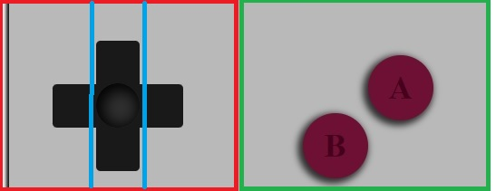

<h1>Consola Game Boy</h1>

En este proyecto se nos pidió que recrearamos una consola/mando con CSS3. Y decidí hacer una Game Boy.

<h2>Desarrolo</h2>

Intenté aplicar lo que aprendí en clase y dvidí el trabajo en pequeñas partes. 
Así, la consola esta dividida en 3 partes: Superior, Centro e Inferior.

En la parte superior, volví a dividir todo en varias partes que me facilitaran el trabajo.
Concretamente esta es la parte que más divisiones tiene. Por eso, he intentado hacer buen uso
de los "id" para no equivocarme.

Luego tenemos la parte Central donde estan la cruceta y los botones A y B. 
La cruceta fue lo que más tiempo me llevo. Al final, opté por lo más sencillo y
la dividi en tres rectángulos.

Y por último, tenemos la parte Inferior. En ella, volví a dividir en tres secciones
el trabajo.

Una vez acabado lo "básico", decidí ponerle detalles. Como la imagen .gif
de la pantalla, el parpadeo del led y el sombreado.

<h3> Hecho con </h3>

-HTML5
-CSS3

<h4> Hecho por </h4>

*Lionel M. Garcia Bustos